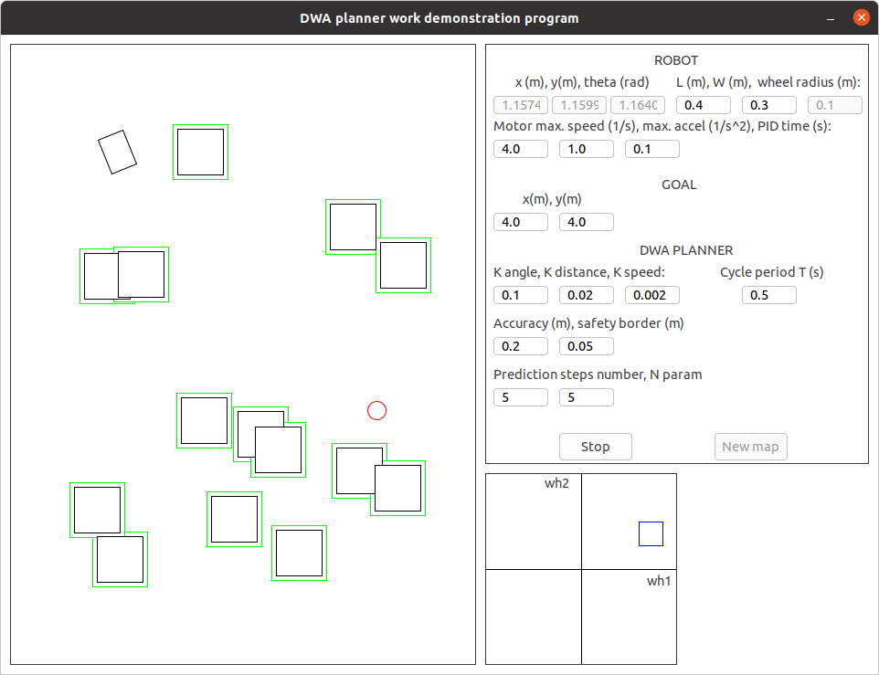

## Installation and launch
### Windows
Download all files from bin/Release/Windows folder to your PC and launch dwa_demo.exe file.

### Linux
1. Download all files from bin/Release/Linux.
2. Run commands in a terminal:
```console
$ chmod +x start.sh
$ ./start.sh
```

## Screenshots


