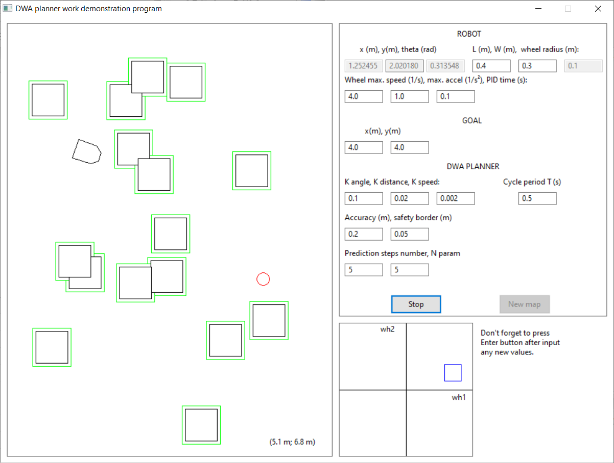
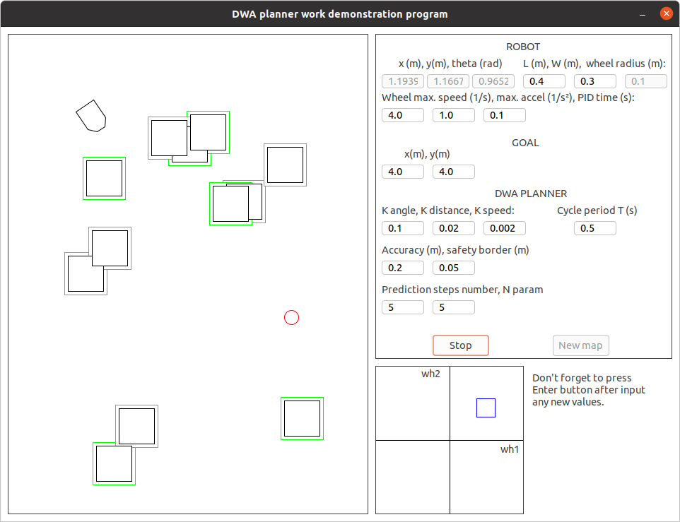

## Building from sources
### Dependencies
- wxWidgets 3.1.5

### General notes
The only thing that should be done before compiling the application is to install the wxWidgets library.

Below you can read about the way that project binaries were built.

### Windows
The Windows executable was built using [Code::Blocks](https://www.codeblocks.org/) IDE in accordance to [this article](https://wiki.codeblocks.org/index.php/WxWindowsQuickRef). There is an appropriate project file (dwa_demo.cbp) in the repository.

To build wxWidgets 3.1.5 from sources this set of options was used:
`BUILD=release SHARED=1 MONOLITHIC=0 UNICODE=1`.

### Linux
wxWidgets library was installed using *Case B* insructions from [here](https://wiki.wxwidgets.org/Compiling_and_getting_started) (but `../configure` command was used without `--with-gtk=3 --with-opengl` options).

Having wxWidgets installed application for Linux can be built with the command:
```console
$ g++ -Iinclude src/*.cpp `wx-config --cxxflags --libs` -o ./bin/Release/Linux/dwa_demo
```

## Screenshots


